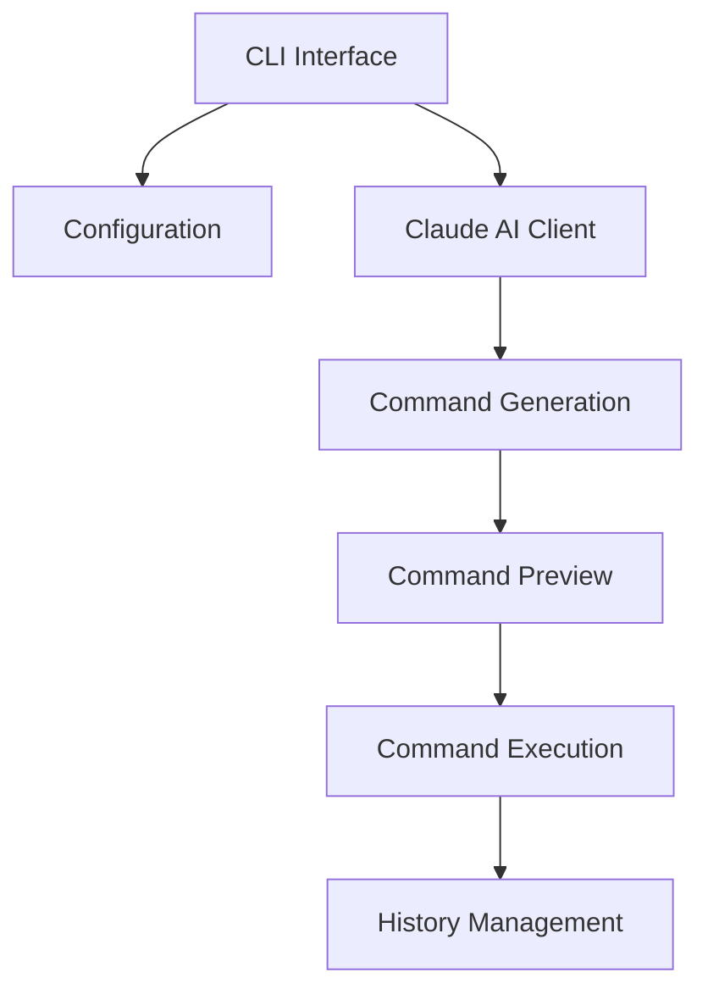
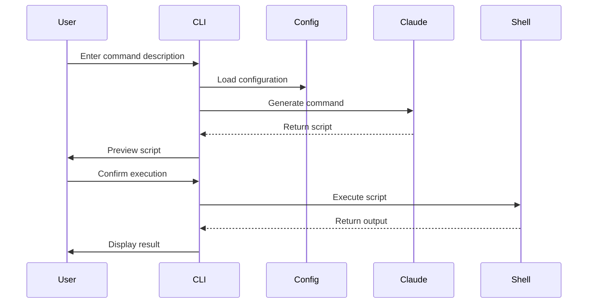

# System Patterns: plz-cli

## Architecture Overview

## Core Components

### 1. CLI Interface (main.rs)
- Uses Clap for argument parsing
- Supports prompt input and force flag
- Handles command-line interaction
- Manages execution flow

### 2. Configuration Management (config.rs)
- Handles environment variables
- Manages API configuration
- Supports shell detection
- Handles history file management

### 3. Command Generation Flow
1. **Input Processing**
   - Combines command arguments
   - Builds context-aware prompt
   - Includes OS-specific hints
   - Captures environment variables

2. **AI Integration**
   - Connects to Claude 3.5 Sonnet
   - Manages API communication
   - Handles response parsing
   - Error management for API issues

3. **Command Execution**
   - Preview generated commands
   - User confirmation system
   - Bash script execution
   - Output handling

## Design Patterns

### 1. Builder Pattern
- Used in prompt construction
- Combines multiple inputs into final prompt
- Handles OS-specific customization

### 2. Factory Pattern
- Config creation and initialization
- Environment variable management
- Shell detection and configuration

### 3. Command Pattern
- Script generation and execution
- History management
- Error handling

## Error Handling

### API Errors
- Client error handling (4xx)
- Server error handling (5xx)
- Graceful degradation
- User-friendly error messages

### Execution Errors
- Command execution failures
- History writing errors
- Environment configuration errors
- Shell compatibility issues

## Performance Considerations
- Synchronous API calls
- Minimal state management
- Direct command execution
- Efficient error handling

## Security Patterns
- API key management
- Command preview before execution
- Environment variable handling
- Shell history management

## Data Flow

## Integration Points
1. Claude 3.5 Sonnet API
2. Shell environment
3. History file system
4. Environment configuration
5. Terminal interface
